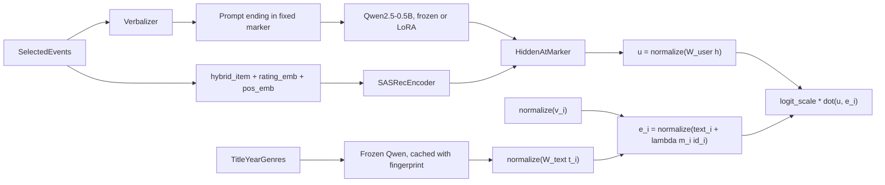

# پلن MiniGenRec (inspired by GenRec)

**محل پروژه:** `/Users/mo/Downloads/minigenrec`، کاملاً جدا از پوشه‌ی شرکت (`/Users/mo/Desktop/sagawisdom`). git و repo عمومی GitHub مخصوص خودش را دارد و هیچ کدی از `sagawisdom` (از جمله `frode`) در آن استفاده نمی‌شود. در README پروژه «inspired by GenRec» معرفی می‌شود، نه بازسازی آن، چون Phase 1، objective زبانی و reward alignment عمداً پیاده نمی‌شوند.

## سؤال پژوهشی

آیا یک LLM متنی که با LoRA آموزش دیده، در شرایط کم‌داده و **synthetic zero-shot item cold-start**، نسبت به sequential recommenderی که **دقیقاً همان eventها و همان metadata** را دریافت می‌کند مزیت دارد یا نه؟ هر دو جواب نتیجه‌ی معتبری است.

مقایسه‌ی اصلی: **MiniGenRec-Hybrid در برابر SASRec-Hybrid**. ورودی هر دو یکسان است و تنها تفاوتشان user encoder است. در کنار آن، پروژه اثر سه عامل را از هم جدا می‌کند: metadata، دانش قبلی LLM، و مدل‌سازی ترتیب رویدادها.

## اجرا

- **کدنویسی:** ایجنت Grok 4.7 طبق همین مشخصات کد را می‌نویسد و تست‌ها را اجرا می‌کند.
- **بازبینی خط به خط:** `data.py`، `metrics.py`، `model.py` و `train.py`. بیشتر باگ‌های نشت داده و mask در حلقه‌ی آموزش و ارزیابی رخ می‌دهند.
- **مک:** تست‌ها، sanity checkها، baselineها، و آزمایش overfit مدل LLM. همه‌ی debug کردن روی مک انجام می‌شود.
- **RunPod A100 80GB (حدود ۱.۲ تا ۱.۶ دلار آمریکا در ساعت):** اجرای `run_all.sh`، با تخمین ۳ تا ۶ ساعت. اعتبار پیش‌پرداخت ۲۰ تا ۳۰ دلار آمریکا کافی است. **قبل از خاموش کردن pod**، پوشه‌های `results/`، configها، logها و LoRA adapterها به storage ماندگار منتقل می‌شوند (دانلود یا Hugging Face Hub).

## قرارداد داده

**تعریف پایه**
- **داده:** MovieLens 1M با عنوان، سال و ژانر
- **هدف مثبت:** امتیاز ۴ و ۵
- **ترتیب:** مرتب‌سازی پایدار بر اساس `(timestamp, movie_id)`. history هر نمونه فقط شامل رویدادهایی است که در این ترتیب قبل از target آمده‌اند.

**فیلم‌های cold**
- انتخاب به‌صورت طبقه‌بندی‌شده بر اساس دهک‌های محبوبیت و با seed ثابت انجام می‌شود.
- تعاملات فیلم‌های cold از همه‌ی historyها حذف می‌شود، هم در آموزش و هم در تست.
- فیلم cold هیچ‌وقت target آموزشی نیست و در softmax آموزش هم نیست؛ softmax آموزش فقط روی فیلم‌های warm حساب می‌شود.
- metadata فیلم cold در inference در دسترس است، ولی ID embedding آن در امتیاز دخالتی ندارد (`m_i = 0`).

**split فیلم‌های warm**
- برای هر کاربر، آخرین هدف مثبت warm برای test، یکی قبل از آن برای validation، و بقیه برای train.
- کاربرانی که کمتر از ۳ هدف مثبت warm دارند حذف می‌شوند.

**مجموعه‌ی cold-test با cutoff زمانی**
- برای هر کاربر، `train_cutoff` برابر موقعیت آخرین target آموزشی او در ترتیب زمانی است.
- cold-test شامل همه‌ی تعاملات مثبت با فیلم‌های cold است که **بعد از** `train_cutoff` رخ داده‌اند، هر کدام با history قبل از خودش.
- به این ترتیب، همه‌ی نمونه‌های test در آینده‌ی داده‌ی آموزشی همان کاربر قرار می‌گیرند.

**قانون از پیش ثبت‌شده برای نسبت cold**
- قبل از هر آموزشی و فقط بر اساس شمارش نمونه‌ها تصمیم گرفته می‌شود: اگر cold-test با نسبت ۱۰٪ کمتر از **۱۰۰۰ کاربر** یا کمتر از **۲۰۰۰ تعامل** داشته باشد، نسبت ۲۰٪ استفاده می‌شود؛ در غیر این صورت ۱۰٪.
- این قانون در `config.py` و README ثبت می‌شود. بعد از مشاهده‌ی هر نتیجه‌ای تغییر نمی‌کند.

**HistorySelector مشترک**
- جدیدترین **K رویداد** انتخاب می‌شوند و سپس به ترتیب قدیم به جدید مرتب می‌شوند. **دقیقاً همین رویدادها** به همه‌ی مدل‌ها داده می‌شوند.
- بودجه بر اساس تعداد رویداد تعریف می‌شود، نه تعداد توکن. در غیر این صورت ablationهای عنوان (که طول توکن‌ها را تغییر می‌دهند) رویدادهای متفاوتی انتخاب می‌کنند.
- K یک بار و قبل از آموزش انتخاب می‌شود: بزرگ‌ترین مقداری که prompt در صدک ۹۹ در `max_len = 512` جا شود (احتمالاً حدود ۲۵ تا ۳۰ رویداد). مقدار انتخاب‌شده در config ثبت می‌شود.
- **fallback برای promptهای بلندتر:** اگر prompt با K رویداد جا نشد، قدیمی‌ترین رویداد **به‌طور کامل** حذف می‌شود و این کار تکرار می‌شود تا prompt جا شود. هیچ رویدادی نصفه truncate نمی‌شود و marker همیشه باقی می‌ماند.
- طول توکنی هر رویداد برای این تصمیم، **بیشینه‌ی طول آن در همه‌ی حالت‌های عنوان** (real، shuffled و none) در نظر گرفته می‌شود. به این ترتیب مجموعه‌ی نهایی رویدادهای هر نمونه برای SASRec و همه‌ی حالت‌های عنوان یکسان است. این مجموعه یک بار محاسبه و cache می‌شود.

**سایر قوانین**
- **انتخاب hyperparameter:** فقط روی validation فیلم‌های warm. روی داده‌ی cold هیچ tuningی انجام نمی‌شود.
- **حجم آموزش:** زیرمجموعه‌های تودرتو `10k ⊂ 30k ⊂ 100k` با seed ثابت. جدول اصلی روی ۱۰۰k است و همه‌ی مدل‌ها دقیقاً همین نمونه‌ها را می‌بینند.
- **seedهای جداگانه:** `cold_split_seed`، `train_subset_seed`، `model_seed`، `title_shuffle_seed` و `bootstrap_seed`. در سه اجرای جدول اصلی **فقط `model_seed`** تغییر می‌کند؛ cold split، نمونه‌های ۱۰۰k، به‌هم‌ریختگی عنوان‌ها و نمونه‌گیری bootstrap ثابت می‌مانند. همه‌ی seedها در فایل نتایج هر اجرا ثبت می‌شوند.

## معیارها و گزارش آماری

- **HitRate@10، NDCG@10 و MRR** روی کل catalog. فیلم‌های موجود در history کاربر mask می‌شوند و این mask برای همه‌ی مدل‌ها یکسان است.
- **تجمیع در سطح کاربر:** ابتدا میانگین معیار روی همه‌ی targetهای هر کاربر گرفته می‌شود، سپس میانگین روی کاربران. در warm-test هر کاربر یک target دارد؛ در cold-test ممکن است چند target داشته باشد.
- **عدم قطعیت:** بازه‌ی اطمینان ۹۵٪ با **paired bootstrap** روی کاربران (۱۰۰۰ بار نمونه‌گیری) برای اختلاف `Δ = MiniGenRec-Hybrid − SASRec-Hybrid` و سایر مقایسه‌های کلیدی. معیار هر کاربر قبل از bootstrap روی سه seed میانگین گرفته می‌شود.
- **پایداری آموزش:** میانگین و انحراف معیار روی سه seed.
- **تفکیک نتایج:** warm-test، cold-test، و cold-test به تفکیک سطح محبوبیت (پرطرفدار، متوسط، کم‌طرفدار).
- **تشخیصی (warm-only catalog):** برای warm-test، معیارها علاوه بر کل catalog روی catalog فقط-warm هم گزارش می‌شوند. اولی شرایط واقعی deployment را نشان می‌دهد. دومی مشخص می‌کند افت احتمالی رتبه‌بندی warm از رقابت با فیلم‌های cold آمده یا از ضعف خود مدل.

## معماری

**item encoder مشترک (Hybrid)**
- `text_i = normalize(W_text · t_i)` و `id_i = normalize(v_i)`
- `e_i = normalize(text_i + λ · m_i · id_i)`
- `λ = softplus(raw_lambda)` با مقدار اولیه‌ی ۰.۱، یعنی `raw_lambda = log(exp(0.1) - 1) ≈ -2.25`. شروع تقریباً text-only است و `λ` همیشه مثبت می‌ماند. با `λ = 0` دقیق، gradient مربوط به `v_i` در گام اول صفر می‌شد.
- «مشترک» یعنی **معماری و ورودی یکسان**، نه instance یا وزن مشترک. هر run از صفر و مستقل آموزش می‌بیند و هیچ وزنی بین runها منتقل نمی‌شود.
- `v_i` با مقدار تصادفی کوچک شروع می‌شود، نه صفر، چون normalize کردن بردار صفر تعریف‌نشده است.
- برای فیلم cold، `m_i = 0` است.
- نسخه‌ی فقط-ID: `e_i = id_i`. نسخه‌ی فقط-متن: `e_i = text_i`.

**user encoder و امتیاز**
- `u = normalize(W_user · h)`. این projection صریح برای Frozen-LLM ضروری است، چون فضای خام hidden state مدل Qwen لزوماً برای retrieval مناسب نیست.
- `score_i = exp(clamp(log_scale, max=log(100))) · dot(u, e_i)`. مقدار اولیه‌ی `log_scale` برابر `log(20)` است. آموزش مستقیم temperature ممکن است آن را صفر یا منفی کند.

**SASRec-Hybrid**
- ورودی در گام j: `e_item[j] + rating_emb[rating_j] + pos_emb[j]`
- رویدادها همان خروجی HistorySelector هستند و item encoder و head هم با MiniGenRec مشترک‌اند.
- یک نسخه‌ی مرجع با history کامل (بدون محدودیت K) هم گزارش می‌شود تا هزینه‌ی این محدودیت برای SASRec معلوم باشد. این نسخه جزو مقایسه‌ی اصلی نیست.

**Loss:** cross-entropy روی فیلم‌های warm، بدون وزن‌دهی در جدول اصلی.

**LLM و cache**
- **Backbone:** `Qwen/Qwen2.5-0.5B`. بعد از اولین دانلود، commit SHA واقعی مدل و tokenizer در `config.py` pin می‌شود و همه‌ی اجراها با همان revision بارگذاری می‌شوند. revision در فایل نتایج هر اجرا هم ثبت می‌شود.
- **Prompt:** هر رویداد به شکل `Title (Year) | Genres | rated R` است و prompt با marker ثابت `\nNext movie:` تمام می‌شود. hidden state آخرین توکن marker، بر اساس attention mask، pool می‌شود.
- **Cache embedding متنی فیلم‌ها:** نام فایل از hash این موارد ساخته می‌شود: model id، revision مدل و tokenizer، حالت عنوان (real، shuffled یا none) و نسخه‌ی metadata.

**برگرفته از GenRec:** verbalization، pooled hidden state، catalog-aware head، softmax روی کل catalog، inference فقط با prefill. **فاصله‌ی عمدی:** embedding ترکیبی فیلم برای پشتیبانی از cold-start.

## Sanity checkها (قبل از RunPod)

- محاسبه‌ی دستی HitRate، NDCG و MRR برای چند کاربر و مقایسه با `metrics.py`
- overfit روی داده‌ی کوچک برای هر مدل. معیار train باید به نزدیک ۱ برسد.
- جابه‌جایی تصادفی برچسب‌ها (label permutation): با targetهای به‌هم‌ریخته، نتیجه باید تا سطح Popularity یا شانس پایین بیاید.
- تست‌های نشت داده در `tests/test_core.py`

## جدول اصلی (۱۰۰k نمونه، سه seed، warm و cold)

1. **Popularity**: sanity check
2. **SASRec-ID**: در cold-start عملاً شانسی عمل می‌کند و این انتظار می‌رود.
3. **SASRec-Hybrid**: همان eventها، rating و item encoder
4. **Frozen-LLM-Hybrid**: فقط projectionها، ID embeddingها، `λ` و `log_scale` آموزش می‌بینند. hidden stateها قابل cache هستند.
5. **MiniGenRec-Hybrid**: LLM با LoRA

## مرحله‌ی بعد (به ترتیب اولویت)

1. **ablation عنوان:** عنوان واقعی، **عنوان‌های به‌هم‌ریخته** (جابه‌جایی تصادفی عنوان‌ها بین فیلم‌ها)، و **بدون عنوان** (placeholder ثابت `[TITLE]`، که عملاً فقط سال و ژانر است). رشته‌ای مثل `Movie_172` استفاده نمی‌شود، چون خودش مثل یک ID عمل می‌کند.
2. **data scaling:** SASRec-Hybrid و MiniGenRec-Hybrid روی زیرمجموعه‌های تودرتوی ۱۰k، ۳۰k و ۱۰۰k با یک seed
3. **نمایش فیلم:** MiniGenRec فقط-متن و فقط-ID

**اختیاری:** rating-weighted cross-entropy (نرمال‌شده با مجموع وزن‌ها)، منحنی elbow طول context، مدل 1.5B، دموی Gradio، پست LinkedIn یا Medium.

**کنار گذاشته شده:** Matrix Factorization، sampled softmax، vLLM، RL، Phase 1، objective زبانی.

## ساختار repo

- [pyproject.toml](/Users/mo/Downloads/minigenrec/pyproject.toml): شامل torch، transformers، peft، pandas و pytest
- [minigenrec/config.py](/Users/mo/Downloads/minigenrec/minigenrec/config.py): پنج seed جداگانه، قانون نسبت cold، K، `max_len` و model id
- [minigenrec/data.py](/Users/mo/Downloads/minigenrec/minigenrec/data.py): دانلود، انتخاب فیلم‌های cold، split، cold-test با cutoff، HistorySelector، نمونه‌های تودرتو
- [minigenrec/metrics.py](/Users/mo/Downloads/minigenrec/minigenrec/metrics.py): معیارها، mask، تجمیع در سطح کاربر، paired bootstrap
- [minigenrec/verbalize.py](/Users/mo/Downloads/minigenrec/minigenrec/verbalize.py): prompt کاربر، متن فیلم در حالت‌های real، shuffled و none
- [minigenrec/sasrec.py](/Users/mo/Downloads/minigenrec/minigenrec/sasrec.py): SASRec encoder با rating embedding
- [minigenrec/model.py](/Users/mo/Downloads/minigenrec/minigenrec/model.py): item encoder (id، text، hybrid با gate)، cache با fingerprint، LLM encoder (frozen یا LoRA)، user projection، head با logit scale
- [train.py](/Users/mo/Downloads/minigenrec/train.py): گزینه‌های `--model popular|sasrec|frozen_llm|genrec --items id|text|hybrid --titles real|shuffled|none --n-train --model-seed --full-history`؛ خروجی `results/<run>.json` و فایل معیار هر کاربر (برای paired bootstrap)
- [report.py](/Users/mo/Downloads/minigenrec/report.py): تجمیع، paired bootstrap، جدول markdown و نمودارها
- [run_all.sh](/Users/mo/Downloads/minigenrec/run_all.sh): اجراهای جدول اصلی به ترتیب؛ اجراهای تمام‌شده دوباره اجرا نمی‌شوند و در پایان نتایج بسته‌بندی می‌شوند
- [tests/test_core.py](/Users/mo/Downloads/minigenrec/tests/test_core.py):
  - فیلم cold در هیچ history، target آموزشی یا softmax آموزش نیست
  - همه‌ی نمونه‌های cold-test بعد از `train_cutoff` کاربرشان هستند
  - هیچ رویدادی از بعد از target در history نیست
  - HistorySelector جدیدترین رویدادها را نگه می‌دارد و برای همه‌ی مدل‌ها یکسان است
  - زیرمجموعه‌های داده تودرتو هستند
  - معیارها با محاسبه‌ی دستی می‌خوانند
  - mask برای همه‌ی مدل‌ها یکسان است
  - target هیچ‌وقت mask نمی‌شود
  - نگاشت بین شناسه‌ی MovieLens، اندیس softmax فیلم‌های warm و اندیس کل catalog در هر دو جهت درست است
  - امتیازها هیچ‌وقت `NaN` یا `Inf` نمی‌شوند
  - gradient فیلم‌های cold به ID embedding نمی‌رسد
  - در حالت frozen هیچ پارامتر Qwen gradient نمی‌گیرد
  - در حالت LoRA فقط adapterها و headهای تعیین‌شده trainable هستند
  - بعد از padding و fallback حذف رویداد، موقعیت pool شده دقیقاً آخرین توکن marker است
  - prompt هیچ‌وقت از `max_len` بیشتر نمی‌شود و هیچ رویداد نصفه‌ای ندارد

## ترتیب کار امشب

1. نوشتن مشخصات کار برای Grok. بعد Grok پروژه، `config.py`، `data.py`، `metrics.py` و تست‌ها را می‌سازد. بعد بازبینی، و اجرای قانون نسبت cold و انتخاب K با ثبتشان در config. سپس یک اجرای end-to-end بسیار کوچک (چند صد نمونه، همه‌ی مدل‌ها) برای اطمینان از اینکه کل مسیر کار می‌کند.
2. Popularity، SASRec-ID و SASRec-Hybrid روی مک، همراه با sanity checkها. بازبینی `train.py`.
3. verbalize و model، و آزمایش overfit روی ۱۰۰ کاربر روی مک. بازبینی `model.py`.
4. اجرای `run_all.sh` روی RunPod، انتقال نتایج و adapterها، خاموش کردن pod. سپس `report.py` و README.

## ریسک‌ها

- **MiniGenRec از SASRec-Hybrid بدتر شود:** نتیجه‌ی معتبری است و صادقانه گزارش می‌شود.
- **cold-test بعد از اعمال cutoff کوچک شود:** قانون از پیش ثبت‌شده‌ی نسبت ۲۰٪ این را پوشش می‌دهد. اگر حتی با ۲۰٪ هم کم بود، در README به‌عنوان محدودیت گزارش می‌شود و پروتکل تغییر نمی‌کند.
- **محدودیت K برای SASRec:** نسخه‌ی مرجع با history کامل هزینه‌ی این محدودیت را شفاف نشان می‌دهد.
- **باگ در لحظه‌ی آخر:** debug روی مک انجام می‌شود و `run_all.sh` اجراهای تمام‌شده را دوباره اجرا نمی‌کند.
- **وقت کم بیاید:** اولویت با جدول اصلی است، بعد ablation عنوان، بعد data scaling.
